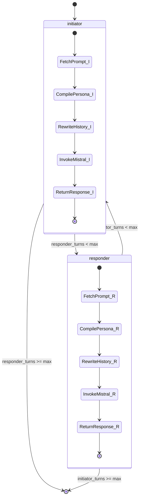
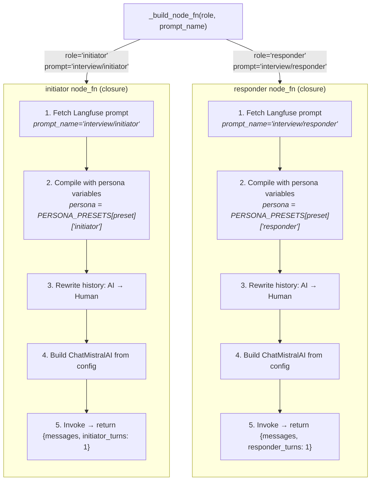
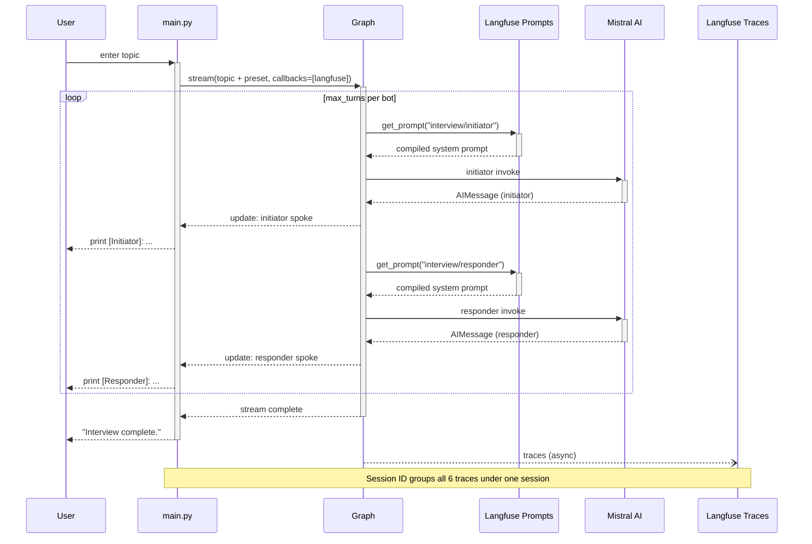
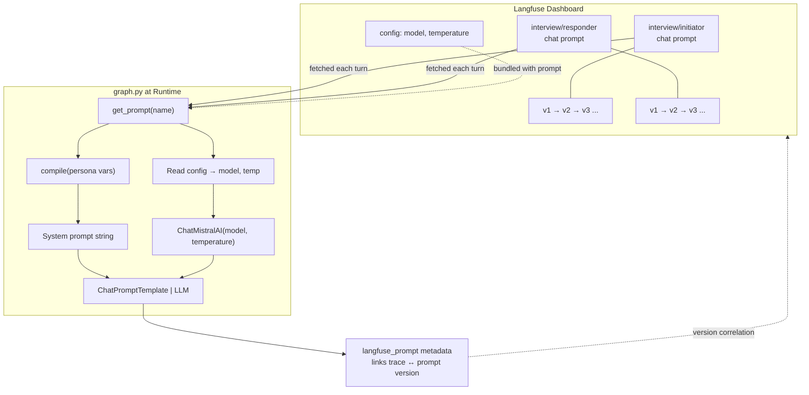
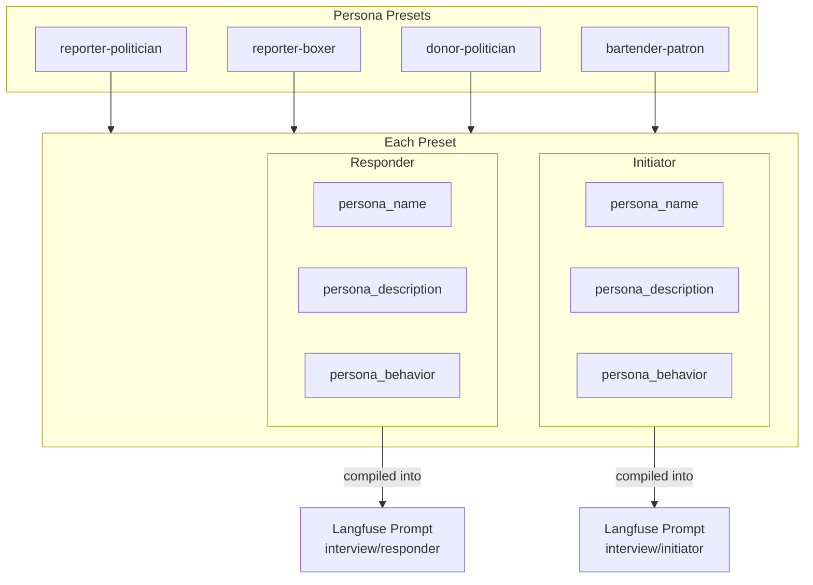
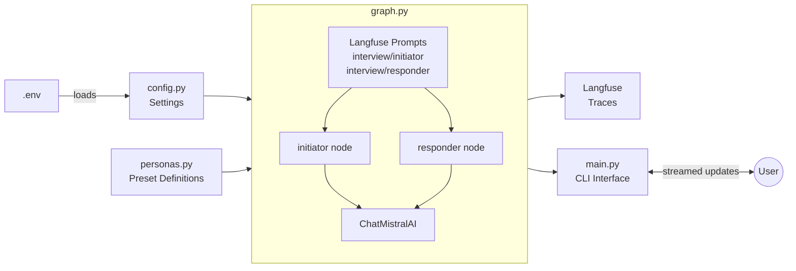
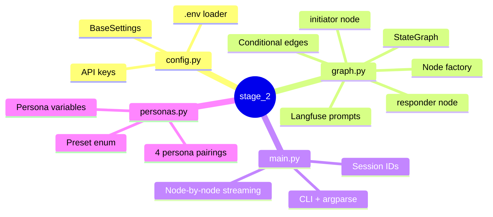

# Building the Harness, Not the Demo: What a Two-Bot Interview Taught Me About Production AI

> **Source code**: [Stage 2 — Two-Bot Interview](../../src/stage_2/)

---

## I. The Demo Trap

Everyone builds an impressive AI demo in weeks, then spends months making it production-grade. The demo is the model call. The months are everything around it: retry logic, prompt versioning, trace collection, state management, graceful degradation, configuration that doesn't require a redeployment.

> "The model is the engine, but the harness is the car."

That line, from *Architecting the Agentic Harness*, reframes how I think about AI engineering. The model is a commodity. The engineering that wraps it — orchestration, observability, configurability — is what separates a weekend project from a system you'd trust in production. What if you practiced harness-first thinking even on a small project?

That's what Stage 2 is. Two AI personas — an initiator and a responder — take turns speaking on a user-provided topic. A Reporter grills a Politician. A Bartender dispenses wisdom to a Patron at 1 AM. A Boxer threatens to flip the table at a press conference. The conversations are entertaining. But this blog isn't about the conversations. It's about the system that produces them: a LangGraph conditional loop with Langfuse prompt management, full observability, and clean separation of concerns.

I built a small multi-agent system and treated it like a production system from day one. The rest of this post walks through three areas, each mapped to a pillar from the agentic harness essay:

- **Orchestration**: A two-node conditional graph with a factory pattern, typed state, and message rewriting
- **Observability**: Automatic tracing, session grouping, prompt-version-to-trace linking
- **Prompt management as infrastructure**: Prompts and model config live outside the codebase, versioned, editable from a dashboard

The patterns in Stage 2 — state graph orchestration, externalized prompt management, trace-level observability — are the same patterns that production multi-agent systems in law, healthcare, and finance use. The domain is different. The engineering is identical.

---

## II. What Stage 2 Does

Two AI personas take turns speaking on a user-provided topic. The graph alternates between an `initiator` node and a `responder` node until a configurable turn limit is reached. Each node fetches its system prompt from Langfuse, compiles it with persona variables, rewrites message history for Mistral's API constraints, invokes the LLM, and returns the response. The CLI streams each response as it arrives. Every LLM call is traced in Langfuse with session grouping and prompt version linking.

**The tech stack:**

- **LangGraph** (v1.0+) — state graph with conditional edges
- **Mistral AI** (`mistral-small-latest`) via `langchain-mistralai` — the LLM
- **Langfuse** (v3) — prompt management + observability (dual role)
- **Pydantic Settings** — typed configuration from `.env`
- **uv workspaces + Hatchling** — packaging

**The persona presets:**

| Preset | Initiator | Responder | Vibe |
|--------|-----------|-----------|------|
| `reporter-politician` | Serious investigative journalist | Seasoned, ethically questionable politician | Tough questions meet evasive pivots |
| `reporter-boxer` | Sports journalist at a press conference | Brash, confident professional boxer | Professional inquiry meets trash talk |
| `donor-politician` | Wealthy donor with business interests | Desperate-for-funding politician | Transactional politeness meets plausible deniability |
| `bartender-patron` | Weary, seen-it-all late-shift bartender | Drunk patron at 1 AM | Dry wisdom meets emotional rambling |

### The Graph Shape



The graph is two nodes, two conditional edges, and a turn counter. The interesting engineering is in everything around it.

---

## III. Pillar 1 — Orchestration: The Decisions That Compound

> "This is microservices architecture applied to cognitive work. The patterns are familiar to anyone who has built distributed systems: service decomposition, message passing, state management."

### A. The Node Factory Pattern

`_build_node_fn(role, prompt_name)` in `graph.py` is a factory function that returns a closure. Call it with `("initiator", "interview/initiator")` and you get the initiator node function. Call it with `("responder", "interview/responder")` and you get the responder node function. Both nodes run the same 5-step pipeline — only the persona variables and turn counter key differ.

From `graph.py:61-138`:

```python
def _build_node_fn(role: str, prompt_name: str):
    turns_key = f"{role}_turns"
    name_key = f"{role}_name"
    other_role = "responder" if role == "initiator" else "initiator"
    other_name_key = f"{other_role}_name"

    def node_fn(state: InterviewState, config: RunnableConfig) -> dict:
        # 1. Fetch prompt from Langfuse
        langfuse = get_client()
        lf_prompt = langfuse.get_prompt(prompt_name, type="chat")

        # 2. Compile with persona variables
        persona = PERSONA_PRESETS[state["preset"]][role]
        compiled_messages = lf_prompt.compile(
            persona_name=persona["persona_name"],
            persona_description=persona["persona_description"],
            persona_behavior=persona["persona_behavior"],
            other_persona=state[other_name_key],
        )
        system_content = compiled_messages[0]["content"]

        # 3. Rewrite message history (AI → Human for Mistral alternation)
        # ... (detailed in section III-C)

        # 4. Build LLM from prompt config
        model_config = lf_prompt.config or {}
        llm = ChatMistralAI(
            model=model_config.get("model", "mistral-small-latest"),
            temperature=model_config.get("temperature", 0.9),
            api_key=_settings.mistral_api_key,
        )

        # 5. Invoke chain
        chain = langchain_prompt | llm
        response = chain.invoke({"messages": history}, config=config)
        response.name = state[name_key]
        return {"messages": [response], turns_key: 1}

    node_fn.__name__ = role
    return node_fn

initiator = _build_node_fn("initiator", "interview/initiator")
responder = _build_node_fn("responder", "interview/responder")
```

The factory eliminates duplication — both nodes share structure but not state. This is the LangGraph equivalent of service decomposition from the essay. Each node is a specialized worker with its own persona, its own prompt name, its own turn counter. The factory ensures they are built from the same blueprint.

In a larger system with 5 or 10 agent roles, this factory pattern prevents the codebase from growing linearly with agent count. Add a new role by calling the factory with new parameters, not by copying and modifying a node function.



### B. State Design: InputState vs InterviewState

Two state classes in `graph.py:42-55`:

```python
class InputState(MessagesState):
    max_turns: int
    preset: Preset
    initiator_name: str
    responder_name: str

class InterviewState(InputState):
    initiator_turns: Annotated[int, operator.add]
    responder_turns: Annotated[int, operator.add]
```

`InputState` is the graph's public API — the fields a caller provides. `InterviewState` extends it with internal turn counters that use `operator.add` reducers. The graph is compiled with `StateGraph(InterviewState, input=InputState)`, so LangGraph enforces the split: callers see `InputState`, nodes see `InterviewState`.

This is the equivalent of separating an API contract from internal implementation state. The caller cannot accidentally set `initiator_turns` to 5. The graph initializes internal state to zero. The `operator.add` annotation means each node returns `{turns_key: 1}` and LangGraph accumulates — no node needs to read, increment, and write back. This eliminates a class of off-by-one and race-condition bugs.

The essay describes "managing state across long-running workflows." The InputState/InterviewState split is a concrete implementation of that principle — clean boundaries between what the orchestrator exposes and what it manages internally.

### C. Message Rewriting — The Unglamorous Problem

Mistral's API requires strict user/assistant message alternation. But in a two-bot system, both bots produce `AIMessage`s. If the initiator's response is an `AIMessage` and the responder also produces an `AIMessage`, the conversation history from either bot's perspective has two consecutive assistant messages — which Mistral rejects.

Each node rewrites the conversation history before invoking the LLM. All `AIMessage`s in the shared history are converted to `HumanMessage`s, preserving their `content` and `name` attributes. From each bot's perspective, every prior message is user input, and only its own response is the assistant turn.

From `graph.py:95-105`:

```python
from langchain_core.messages import HumanMessage as HM, AIMessage as AIM

history = []
for msg in state["messages"]:
    if isinstance(msg, HM):
        history.append(msg)
    elif isinstance(msg, AIM):
        history.append(HM(content=msg.content, name=msg.name))
```

This is the kind of problem that never surfaces in a single-bot demo. It only appears when you wire a second agent into the loop and the model API's constraints collide with your multi-agent architecture. It's unglamorous. It's essential. And it demonstrates that the author has actually built and debugged a multi-agent system, not just diagrammed one.

> "Instead of deterministic functions, you are orchestrating probabilistic reasoning engines. That changes everything."

Message rewriting is a concrete example of what "that changes everything" looks like. The model API has opinions about conversation structure, and the harness must accommodate them. This is not prompt engineering — it's systems engineering.

### D. Conditional Edges and Turn Management

Two routing functions control the conversation flow. From `graph.py:151-163`:

```python
def after_initiator(state: InterviewState) -> str:
    if state["responder_turns"] < state["max_turns"]:
        return "responder"
    return END

def after_responder(state: InterviewState) -> str:
    if state["initiator_turns"] < state["max_turns"]:
        return "initiator"
    return END
```

After the initiator speaks, the graph checks whether the *responder* still has turns remaining. After the responder speaks, it checks the *initiator*. This cross-check creates the ping-pong pattern and guarantees termination — the graph always ends after exactly `max_turns * 2` messages.

Deterministic termination is a reliability property. The essay talks about "retry logic, circuit breakers" in orchestration. Conditional edges are the simpler version of the same concern — flow control that guarantees the system halts. There is no infinite loop. There is no ambiguous stopping condition. The graph algebra enforces it.

The graph construction itself — show how simple the wiring is. From `graph.py:168-180`:

```python
def create_graph(input_schema: type = InputState) -> CompiledStateGraph:
    builder = StateGraph(InterviewState, input=input_schema)
    builder.add_node("initiator", initiator)
    builder.add_node("responder", responder)
    builder.add_edge(START, "initiator")
    builder.add_conditional_edges("initiator", after_initiator, ["responder", END])
    builder.add_conditional_edges("responder", after_responder, ["initiator", END])
    return builder.compile()

graph = create_graph()
```

Nine lines. Two nodes, three edges. The simplicity is the point — the orchestration layer is minimal and readable, with the complexity pushed into the node factory and state design where it belongs.

---

## IV. Pillar 2 — Observability: Seeing Inside the Conversation

> "Without purpose-built observability, you are flying blind in a system that is designed to be non-deterministic."

### A. Automatic Instrumentation via CallbackHandler

A single `CallbackHandler` from `langfuse.langchain` is created per CLI run and passed through `config["callbacks"]`. LangGraph's execution engine automatically calls the handler's hooks on every node invocation — no manual span creation, no decorators, no `with trace():` blocks.

From `main.py:62-83`:

```python
langfuse_handler = get_langfuse_handler()

for update in graph.stream(
    {
        "messages": [HumanMessage(content=f"Interview topic: {topic}")],
        "max_turns": max_turns,
        "initiator_turns": 0,
        "responder_turns": 0,
        "preset": preset_key,
        "initiator_name": initiator_name,
        "responder_name": responder_name,
    },
    config={
        "callbacks": [langfuse_handler],
        "metadata": {
            "langfuse_session_id": session_id,
        },
    },
    stream_mode="updates",
):
```

For every LLM call, the trace captures:
- **Full input**: compiled system prompt + rewritten message history
- **Full output**: the `AIMessage` response
- **Token counts**: input + output
- **Latency**: wall-clock time for the LLM call
- **Model name and version**
- **The prompt version link** (via `langfuse_prompt` metadata)

A 3-turn interview produces 6 traced LLM calls (3 initiator + 3 responder). Each trace is a complete record of one node's execution. Together, they form a full conversation timeline.

The essay calls for "trace-level visibility into every LLM call: prompt in, completion out, latency, token count, model version." Stage 2 implements this with two lines of code — creating the handler and passing it in config. The infrastructure cost is near-zero. The visibility it provides is total.

### B. Session Grouping

`main.py` generates a unique session ID per run. From `main.py:41`:

```python
session_id = f"interview-{uuid.uuid4().hex[:8]}"
```

This ID is passed through `config["metadata"]["langfuse_session_id"]`. Langfuse uses it to group all traces from one interview under a single session in the dashboard.

Without session grouping, you'd have 6 individual traces floating in the Langfuse dashboard with no connection between them. With it, you see one session containing the full Reporter-vs-Politician transcript as a single unit. You can:

- View the entire conversation timeline in order
- See total cost and latency for the whole interview
- Compare sessions across different presets, topics, or prompt versions
- Identify which interview runs took longer or cost more

The essay describes "agent-level operational metrics: success rates, average reasoning steps per task, escalation frequency, cost per completion." Session grouping is the mechanism that makes these metrics queryable. Without it, you have individual traces. With it, you have operational intelligence scoped to a conversation.

### C. Async Flush and Production Hygiene

Langfuse traces are shipped asynchronously — the tracing never blocks the conversation. At shutdown, the client flushes remaining traces. From `graph.py:183`:

```python
atexit.register(get_client().flush)
```

And from `main.py:102`:

```python
get_langfuse_client().flush()
```

Both a belt and suspenders: `atexit` catches unexpected exits, the explicit flush in `main.py` ensures traces are shipped before the normal exit prints. It's a small detail that signals production thinking. Demo code doesn't worry about trace flushing. Production code does.



---

## V. Prompt Management as Infrastructure

> "The engineer's primary artifact is no longer a function that computes a result. It is a harness that orchestrates, validates, and monitors something else computing the result."

### A. Prompts Outside Code

The two system prompts — `interview/initiator` and `interview/responder` — live in Langfuse as managed chat prompts, not as Python strings in the repo. Each prompt is a template with four variables: `persona_name`, `persona_description`, `persona_behavior`, `other_persona`.

On every node invocation, the runtime flow is:

1. Fetch the prompt from Langfuse by name: `langfuse.get_prompt(prompt_name, type="chat")`
2. Compile with persona variables: `lf_prompt.compile(persona_name=..., ...)`
3. Extract the system content: `compiled_messages[0]["content"]`
4. Build a `ChatPromptTemplate` with the compiled system message + `MessagesPlaceholder` for history
5. Attach `langfuse_prompt` metadata to link trace to prompt version

From `graph.py:78-114`:

```python
# Fetch + compile
lf_prompt = langfuse.get_prompt(prompt_name, type="chat")
compiled_messages = lf_prompt.compile(
    persona_name=persona["persona_name"],
    persona_description=persona["persona_description"],
    persona_behavior=persona["persona_behavior"],
    other_persona=state[other_name_key],
)
system_content = compiled_messages[0]["content"]

# Build LangChain prompt and link to Langfuse version
langchain_prompt = ChatPromptTemplate.from_messages([
    ("system", system_content),
    MessagesPlaceholder("messages"),
])
langchain_prompt.metadata = {"langfuse_prompt": lf_prompt}
```

Editing a prompt is a dashboard operation — open Langfuse, change the wording, save. The next graph invocation picks up the new version automatically. No code change. No PR. No redeployment. This is the production pattern for teams that iterate on prompts daily.

### B. Model Config Outside Code

Each Langfuse prompt carries a `config` object with model parameters. The node factory reads `model` and `temperature` from this config when constructing the `ChatMistralAI` instance. From `graph.py:117-122`:

```python
model_config = lf_prompt.config or {}
llm = ChatMistralAI(
    model=model_config.get("model", "mistral-small-latest"),
    temperature=model_config.get("temperature", 0.9),
    api_key=_settings.mistral_api_key,
)
```

Switching from `mistral-small-latest` to `mistral-medium-latest`, or tuning temperature from 0.9 to 0.7, is a dashboard change. The code has sensible defaults but defers to the prompt config. This makes the model a swappable component controlled from outside the codebase.

> "The harness is model-agnostic by design. It treats the foundation model as a swappable component — because the real intellectual property is in how you *use* the model, not in the model itself."

Stage 2's architecture makes this literal. The model name is a config value fetched at runtime.

### C. Version History and the Trace-to-Prompt Link

Every prompt edit in Langfuse creates a new version. The `langfuse_prompt` metadata attached to each `ChatPromptTemplate` records which version was used for each LLM call. This creates a bidirectional link:

- **From trace to prompt**: Open a trace in Langfuse → see which prompt version produced it → read the exact text
- **From prompt to traces**: Open a prompt version in Langfuse → see all traces that used it → evaluate quality

Here's what that looks like in practice:

1. You run 10 interviews with `reporter-politician` over two days
2. Tuesday's interviews feel off — the Politician is giving straight answers instead of deflecting
3. You open Langfuse, filter sessions by preset, and compare Tuesday's traces to Monday's
4. Tuesday's traces all link to prompt version v4. Monday's linked to v3.
5. You diff v4 against v3 in the Langfuse UI and find that someone removed the instruction "You never directly answer uncomfortable questions"
6. You roll back to v3. Next interview: the Politician deflects again.
7. Total debugging time: 3 minutes. No code was touched.

This is the data flywheel beginning to turn. The essay describes: "Observability captures traces of every agent interaction. Failed outputs become evaluation data." The trace-to-prompt link is the mechanism. Traces aren't just logged — they're *connected* to the configuration that produced them, making systematic improvement possible.



---

## VI. The Persona System: Data-Driven Extensibility

### A. Personas as Pure Data

`personas.py` contains a `StrEnum` of preset names and a dictionary mapping each preset to initiator/responder persona definitions. Each persona has three fields: `persona_name`, `persona_description`, `persona_behavior`.

From `personas.py:10-68`:

```python
class Preset(StrEnum):
    REPORTER_POLITICIAN = "reporter-politician"
    REPORTER_BOXER = "reporter-boxer"
    DONOR_POLITICIAN = "donor-politician"
    BARTENDER_PATRON = "bartender-patron"

PERSONA_PRESETS: dict[Preset, dict[str, dict[str, str]]] = {
    Preset.REPORTER_POLITICIAN: {
        "initiator": {
            "persona_name": "Reporter",
            "persona_description": "a serious investigative journalist...",
            "persona_behavior": "You press for specifics, follow up on evasions...",
        },
        "responder": {
            "persona_name": "Politician",
            "persona_description": "a seasoned but ethically questionable politician...",
            "persona_behavior": "You deflect hard questions, pivot to talking points...",
        },
    },
    # ... 3 more presets
}
```

Adding a new preset is a 3-step data-only change:

1. Add a new `Preset` enum value
2. Add a matching entry to `PERSONA_PRESETS` with initiator/responder dicts
3. Done. No graph logic, no node code, no Langfuse prompt templates change.

The `--preset` CLI flag picks which pairing to load. The Langfuse prompts accept any persona variables. The node factory compiles whatever persona it receives.

### B. Behavioral Instructions as a Design Surface

The `persona_behavior` field is where the character comes alive. These aren't polite instructions — they're specific, opinionated behavioral directives:

- **Boxer**: "You trash-talk your opponent, boast about your record, make bold predictions, and occasionally threaten to flip the table."
- **Patron**: "You ramble, go on tangents, get emotional, contradict yourself, and occasionally order another drink mid-sentence."
- **Politician**: "You never directly answer uncomfortable questions."

The behavior field is a *prompt engineering surface* that is completely decoupled from the orchestration. You can make the Reporter more aggressive or the Bartender more sympathetic by editing one string in `personas.py` — or, since the prompts are in Langfuse, by editing the template that consumes these variables. Two independent levers: persona data in code, prompt structure in Langfuse.

### C. The StrEnum + Argparse Integration

The `Preset` StrEnum's values are the CLI flag values. From `main.py:17`:

```python
parser.add_argument("--preset", choices=[p.value for p in Preset], ...)
```

The enum value is the string the user types (`reporter-politician`), the enum member is what the code works with (`Preset.REPORTER_POLITICIAN`), and the dictionary lookup uses the enum as a key. One type, three uses, zero string-matching bugs. This is the kind of mundane correctness that signals experience.



---

## VII. Clean Architecture: Four Files, Four Responsibilities

| File | Responsibility | Depends on | Depended on by |
|------|---------------|-----------|----------------|
| `config.py` | Load `.env`, expose typed `Settings` | `.env` | `graph.py` |
| `personas.py` | Define persona presets as pure data | nothing | `graph.py`, `main.py` |
| `graph.py` | Build the state graph, wire nodes, export compiled graph | `config.py`, `personas.py`, Langfuse, Mistral | `main.py` |
| `main.py` | CLI, argument parsing, streaming, session management | `graph.py`, `personas.py` | nothing (entry point) |

The dependency flow: `.env` → `config.py` → `graph.py` ← `personas.py`. `main.py` sits on top and orchestrates the run. There are no circular dependencies. Each file can be understood in isolation.

What this enables:

- **Change persona definitions** → edit `personas.py` only
- **Change prompt wording or model** → edit Langfuse dashboard only (no files at all)
- **Change API keys or Langfuse URL** → edit `.env` only
- **Change CLI behavior** → edit `main.py` only
- **Change graph structure** → edit `graph.py` only

The essay describes "the orchestration layer, the memory system, the validation framework, and the error recovery mechanism — all woven together into a single coherent architecture." Stage 2 is woven together but not entangled. Each concern lives in exactly one place. The system is coherent *because* it is decomposed.





---

## VIII. The Langfuse Singleton Pattern

`graph.py` initializes the Langfuse client once at module load. From `graph.py:21-26`:

```python
_settings = get_settings()
Langfuse(
    public_key=_settings.langfuse_public_key,
    secret_key=_settings.langfuse_secret_key,
    host=_settings.langfuse_base_url,
)
```

Then retrieves it via `get_client()` wherever needed. The `Langfuse()` constructor registers a singleton internally — subsequent `get_client()` calls return the same instance. The `CallbackHandler()` also uses this singleton under the hood.

This demonstrates:

- Understanding of the Langfuse v3 SDK pattern (construct once, retrieve via `get_client()`)
- Resource management (one client, not one per node invocation)
- The `atexit.register(get_client().flush)` that ensures traces ship even on unexpected exit

Production code manages its external clients carefully. Demo code `import`s and prays. It's a small detail, but it's the kind of detail that experienced engineers notice.

---

## IX. Streaming: The User Experience Layer

`main.py` uses `graph.stream(..., stream_mode="updates")` to receive output node-by-node. From `main.py:85-91`:

```python
for node_name, node_output in update.items():
    if "messages" not in node_output:
        continue
    for msg in node_output["messages"]:
        if isinstance(msg, AIMessage):
            speaker = msg.name or node_name
            print(f"\n[{speaker}]: {msg.content}")
```

Each iteration yields a dictionary keyed by node name. The CLI extracts `AIMessage`s and prints them with the speaker's name. The user sees the Reporter's question the moment it arrives, then the Politician's answer, then the next question — a live conversation, not a data dump.

Each node sets `response.name = state[name_key]` before returning (`graph.py:130`), so the `AIMessage` carries the persona's display name. The CLI doesn't need to know which node produced the message — it reads the name from the message itself. This is self-describing data that makes the streaming loop simple and correct.

Before streaming begins, the CLI prints a header with the preset, max turns, and session ID. After streaming ends, it prints a summary with total message count. Context on both sides of the conversation.

---

## X. The Harness Is the Skill

> "The teams that won were not the ones with the best models. They were the ones with the best harnesses."

Stage 2 is a small project — two bots having a conversation. But the engineering behind it is the engineering that scales:

- **A state graph** with typed state, factory-built nodes, and conditional edges for deterministic flow control
- **Observability from the first commit** — every LLM call traced, every session grouped, every prompt version linked
- **Prompt management as infrastructure** — prompts, model config, and persona behavior all externalized and versioned
- **Clean separation of concerns** — four files, four responsibilities, one-directional dependencies

These patterns don't change when the domain changes. Replace "Reporter" with "Triage Agent" and "Politician" with "Diagnostic Agent." Replace persona presets with clinical workflow configs. Replace interview topics with patient intake data. The orchestration is identical. The observability is identical. The prompt management is identical. The harness transfers.

The bots are entertaining. The harness is the resume.
